<iframe src="https://caltopo.com/m/F52FU2S" width="100%" height="400px" frameBorder="0"></iframe>

Black Peak is the highest peak near Rainy Pass. Before heading there, we did some cragging at Exit 34. We were amazed by how many people were at Rainy Pass during larch season. The parking situation was intense—cars lined the road for about 2 miles. Fortunately, since we arrived around 7 p.m., we easily found a spot in the parking lot.

We started hiking at 7:26 p.m. and reached Heather Pass about an hour later. Along the way, we saw a few casual hikers making their way out in the dark, using only their phone flashlights. From Heather Pass, we descended and crossed a boulder field, finally reaching Lewis Lake around 9:41 p.m. We decided not to push further since Wing Lake was still about 1.5 hours away. We camped at a knob near the lake, which was a great spot. There were several other camping spots both at the knob and near the lake.

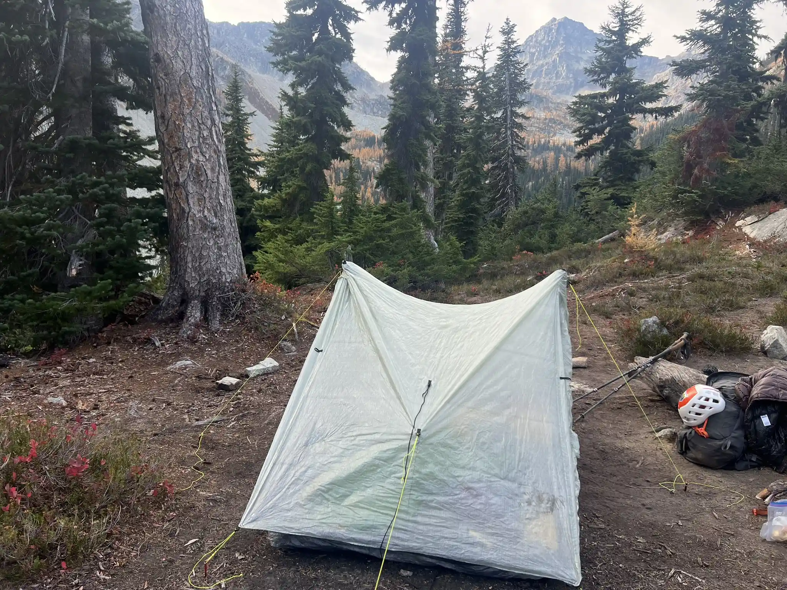 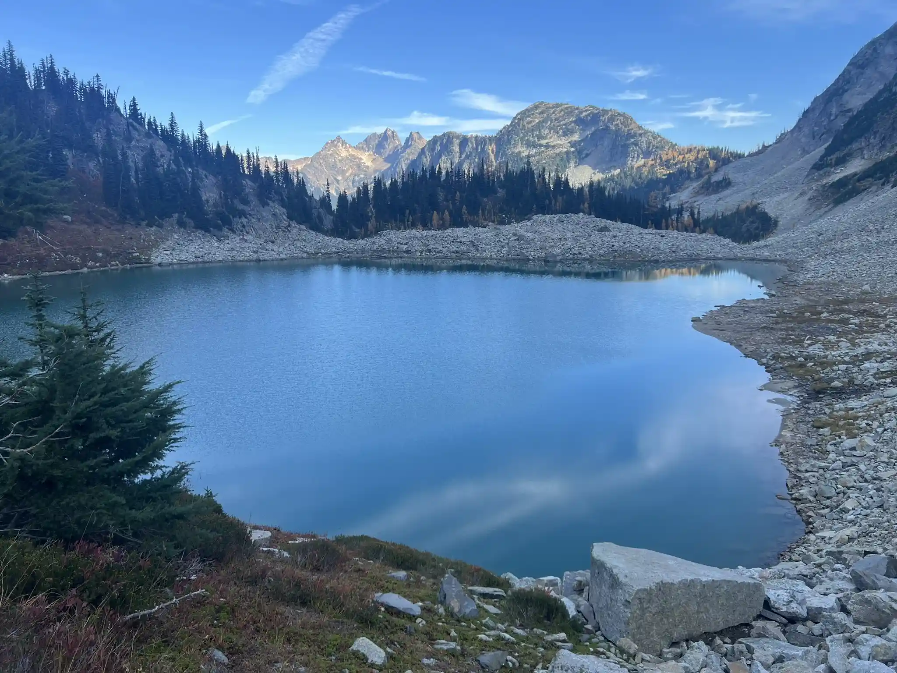

The next day, we set off at 7 a.m. and finally got to see just how stunning the area was during larch season. The larches were at their peak, and they were everywhere! About an hour and a half later, we arrived at Wing Lake, once again amazed—this time by the sheer number of tents. Chutang estimated there were roughly 60–80 tents around the lake, dubbing it the "Black Peak Base Camp" (BBC), though most of the campers were just backpackers.

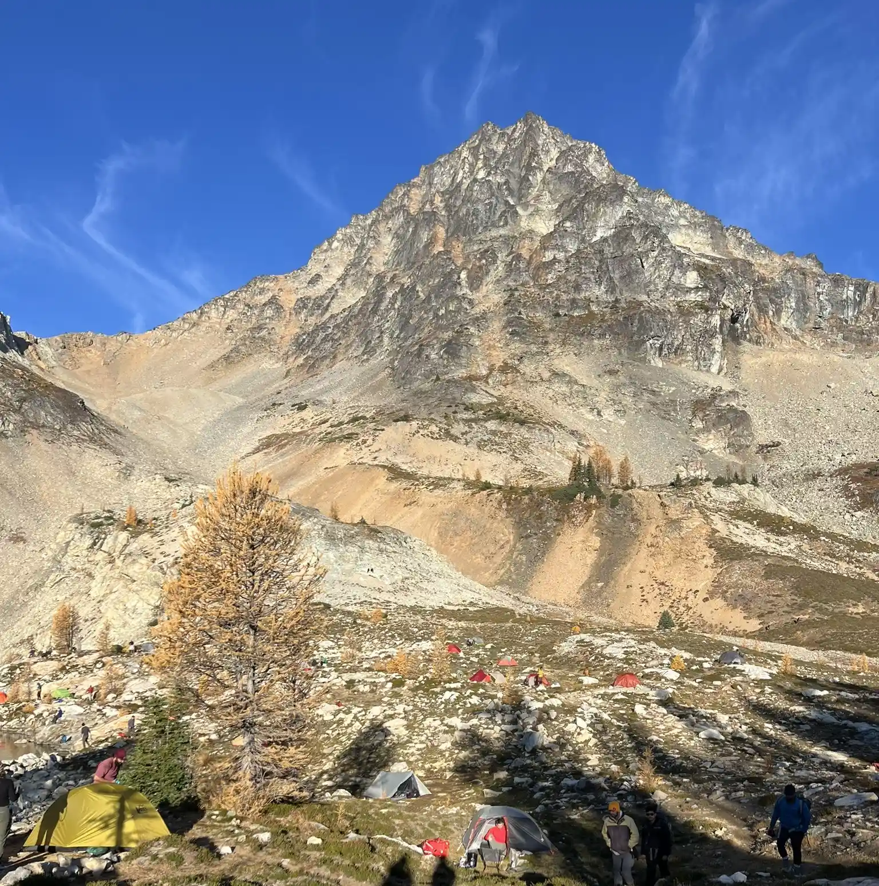 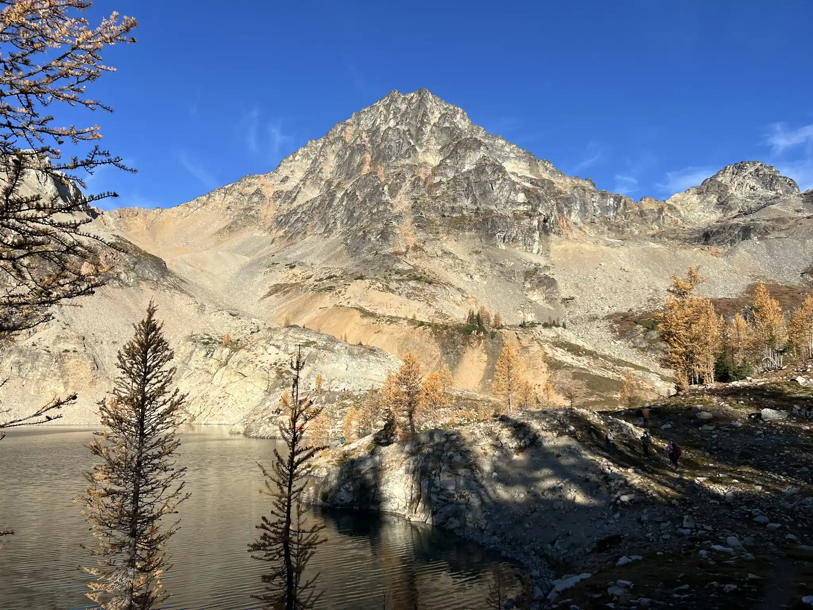

We headed up the basin toward the col, following a well-defined path. By this time of year, the route was snow-free, and the scree field wasn’t too bad to navigate. It was very windy at the col, so I put on my wind jacket right before reaching it. Even though the sun was out, the wind made it feel cold! 

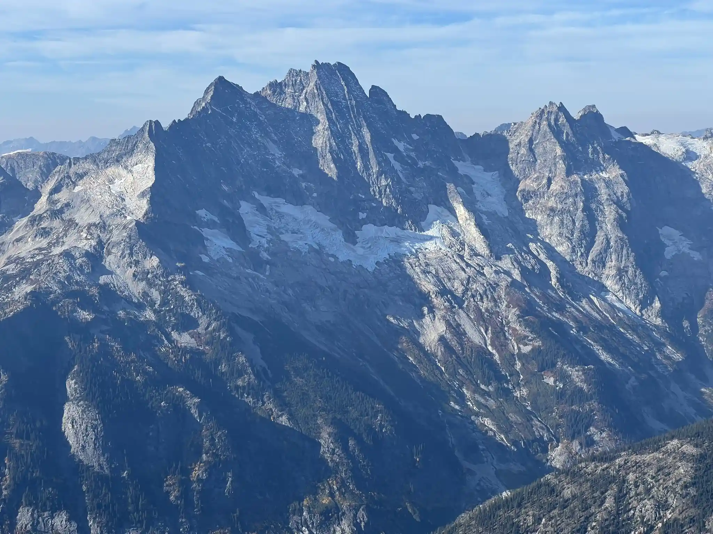 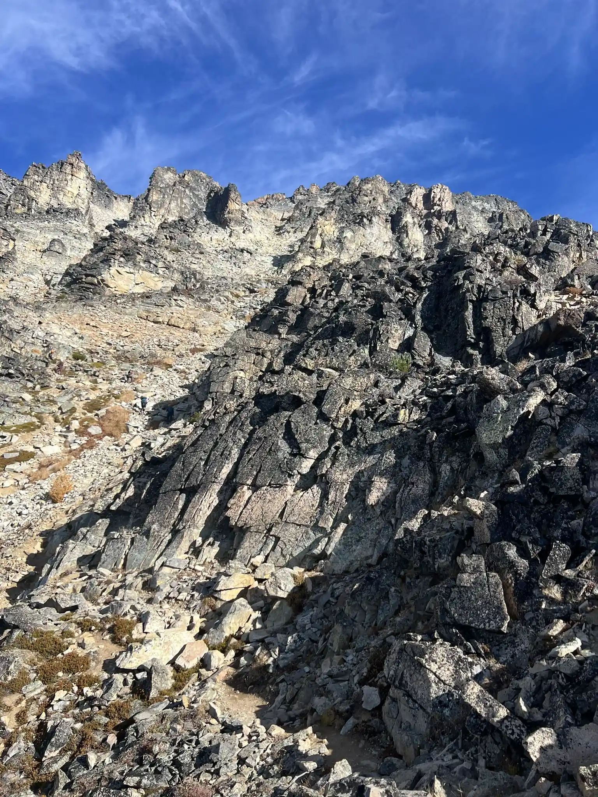

After the col, the terrain became looser, but it wasn’t too troublesome. We stayed mostly on the west side of the ridge, and the route remained obvious. After reaching base of false summit, the standard route traverses to the right, leading to a small saddle, where Black Peak looms to the left. The crux of the climb is a short, 20-foot, exposed Class 3-4 scramble. While I'm not the most experienced scrambler, this was the most exposed section I’ve ever done. Going up was fine, but we definitely felt a bit nervous on the way down. From Lewis Lake to the summit of Black Peak, it took us about 4 hours, including a 30-minute break for breakfast at Wing Lake.

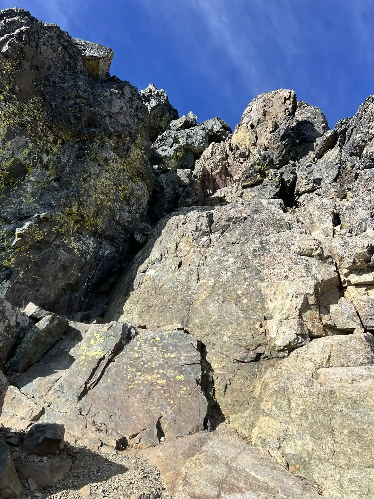 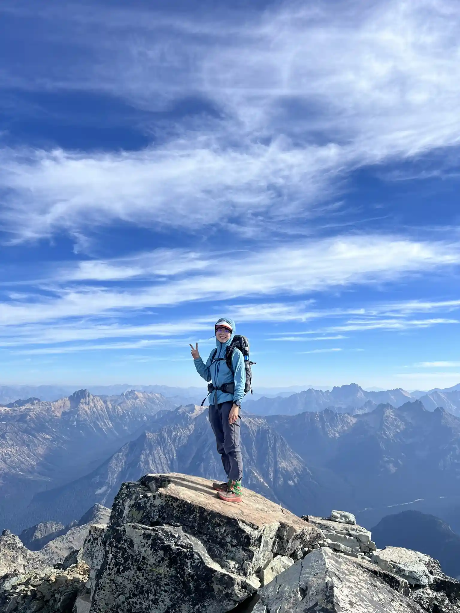

The hike out was uneventful. In total, it took us around 12 hours, including 2 hours on the first day—though we took it slow.

GPS Track: https://caltopo.com/m/F52FU2S

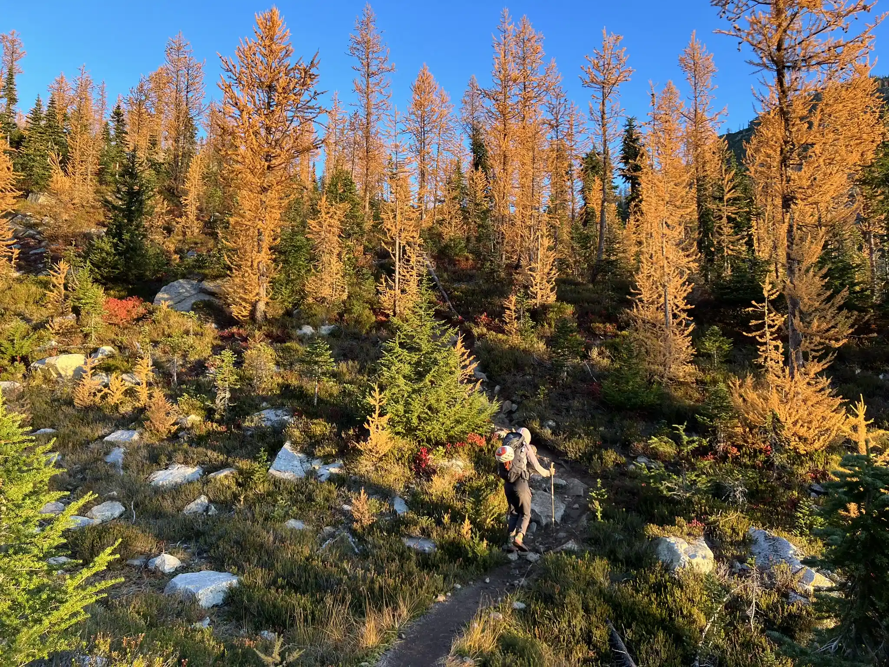  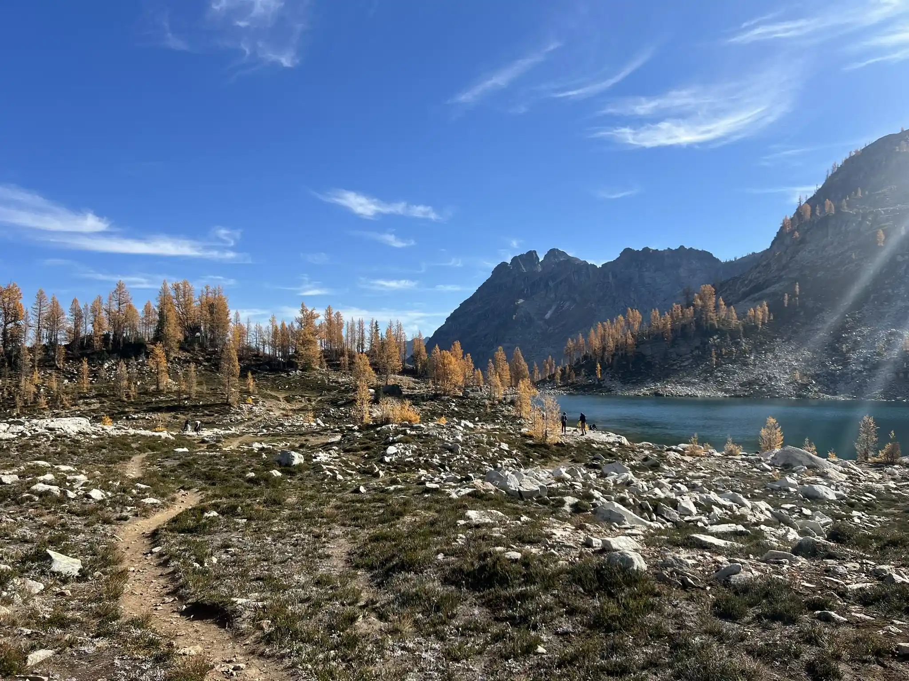  
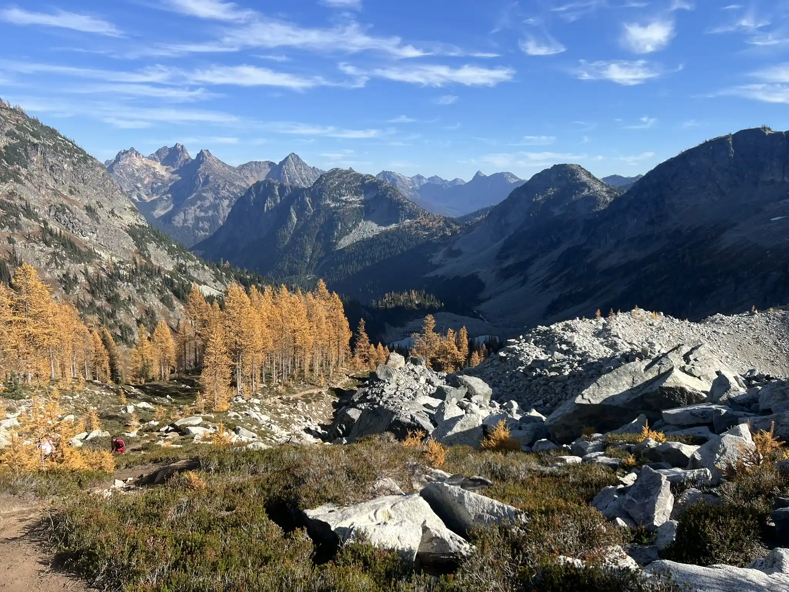  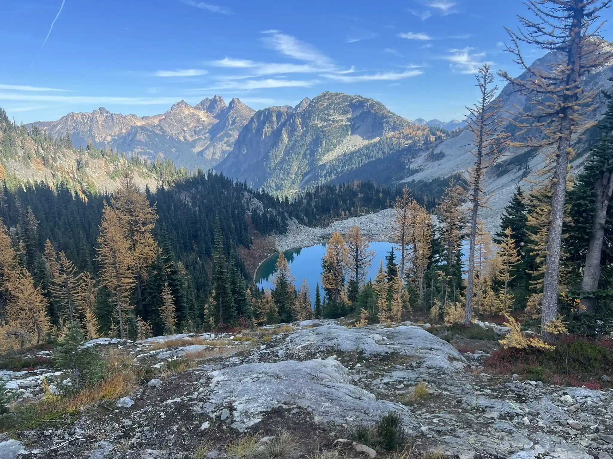   

