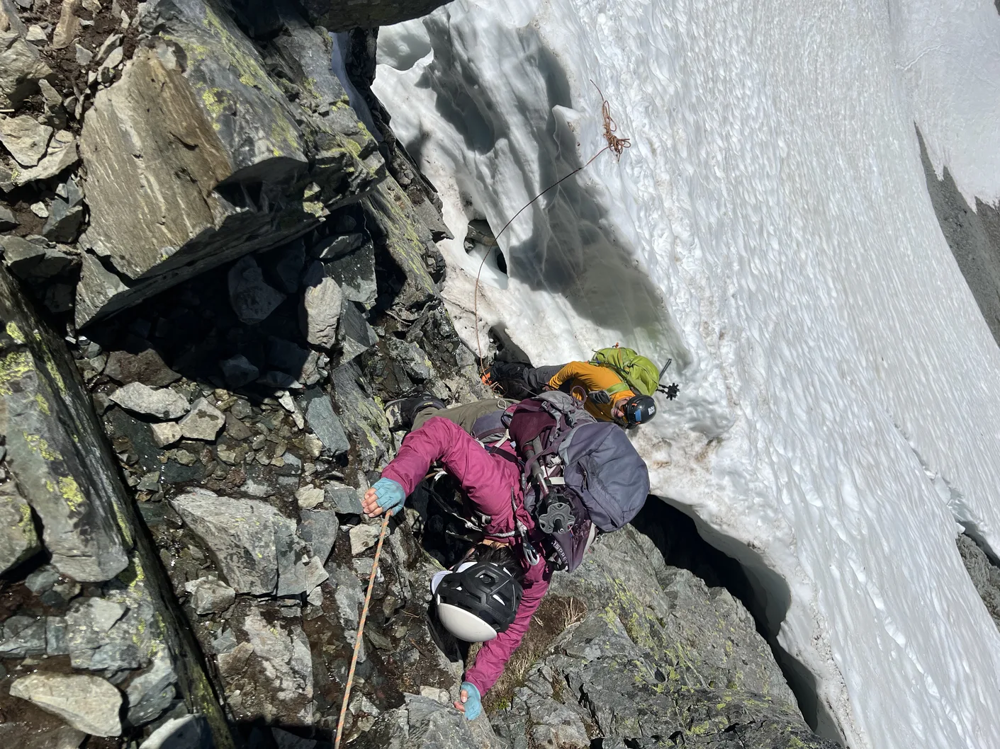
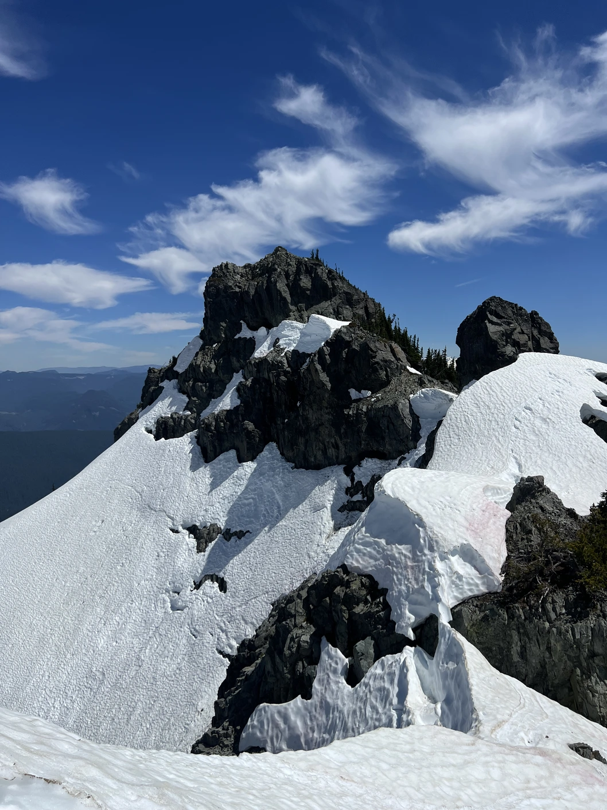
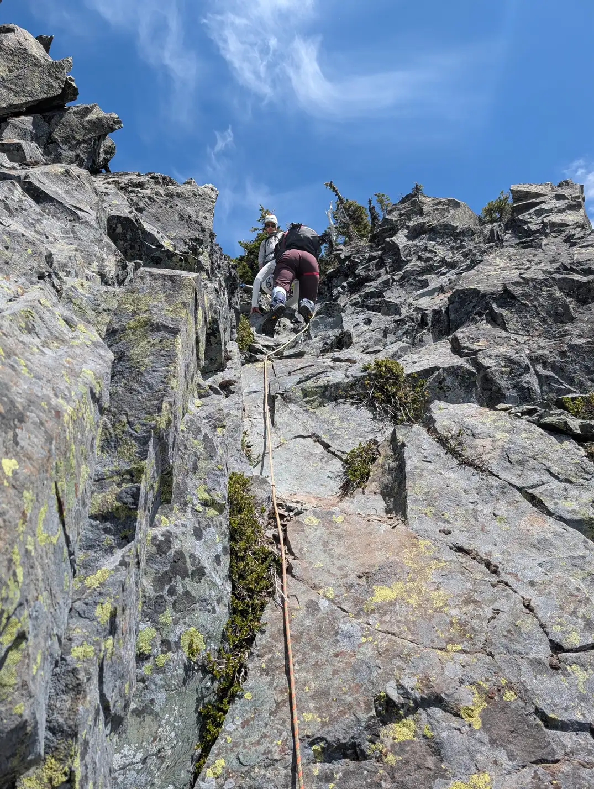

Boundary Peak在我的list上有一段时间了——实际上在2022年我还是scramble学生的时候曾尝试过，但当时因为各种原因中途撤退了。这次终于以mentored leader的身份顺利完成了，全程天气也非常给力。巧的是，我们在登山口集合时发现，其中一位队员居然是Jerrick，他正是我上一次参加这条路线时的领队。

我原本预计这会是一条中等难度的雪地攀登，但实际上比想象中复杂一些。途中遇到两个短小的四级岩段，我都设置了辅助绳下降，还有一段很长的雪岩交错横切路段，需要绕过山脊上的冰缝。这也能理解为什么Jerrick之前尝试了四次，直到越界（公园边界外）路线才最终登顶。他现在希望能通过园区内的常规路线再回来一次。

我们早上8:41从Snow Lake登山口出发，沿着小路前往一个雪崩沟。前面的一队用了冰爪攀爬这个沟，但我们发现并不需要，直接踩着脚点稳步向上。在上升进入盆地后，我们遇到了通往Unicorn和West Unicorn之间鞍部前的一道冰缘裂缝。这是整条路线的一个难点：一小段带有流水的四级岩壁。好在手点和脚点都很结实。我注意到另一队在这里做了保护攀登，而我们小队则顺利无保护攀上去。岩壁上方有两棵树挂着固定吊带和下降环，我检查了其中一个，状态良好，看起来很新。这里的情况和2022年那次不同，当时全是雪并没有moat，而现在有冰缘裂缝，所以按照当时情况而定。

接着我们继续沿雪坡登上山脊。路线去Unicorn方向是往左，我们则右转，沿着山脊往Boundary Peak方向下行。山脊上有大面积雪檐和冰缘裂缝，我们被迫在其下方横切，途中交替经过雪地、岩石和灌木丛。虽然路线寻找稍微复杂，但地形本身不算特别难。

我们绕到山峰背后，找到了通往山顶的最后一个岩沟。这个岩沟是整条路线的另一个难点——大约15英尺（约5米）的松散四级岩攀。我们小队依次单独攀爬，以降低落石风险。攀出岩沟之后，我们顺利登顶。虽然天气预报很热，但山顶有微风，体感非常舒适。

我们在山顶停留了大约20分钟就开始下撤。我在岩沟处布置了辅助绳，有的人使用了，有的人则选择徒手下降。岩石比较松散，我们还是难免踢下了几块石头。回到Unicorn鞍部下方的冰缘裂缝时，我又布置了一次辅助绳。另一队在这里进行了绳降练习，不过以当时的情况来看，并不算必要。通过冰缘裂缝后，我们享受了大约1000英尺（约300米）雪坡滑降回到雪崩沟。接近雪崩沟底部时，积雪变薄，露出了下面的岩石，我们换成plunge-stepping。雪面下方依然比较坚实。

到了沟底，我们踩穿了一层薄雪，经常会掉进下面的乱石，不太理想，不过幸好距离不长。很快我们重新接上了trail，下午5点顺利返回停车场。

GPS track: https://www.peakbagger.com/climber/ascent.aspx?aid=2862448

  
