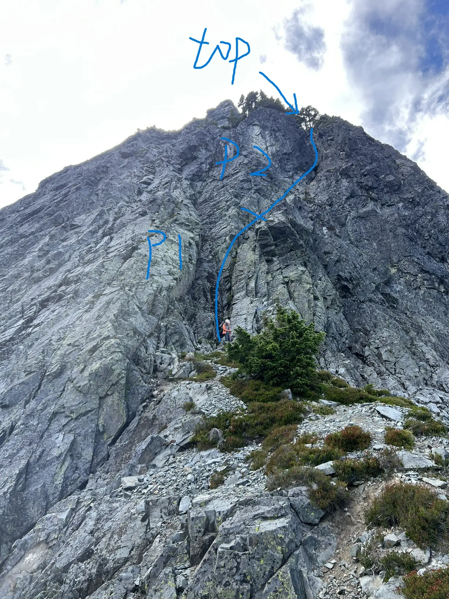
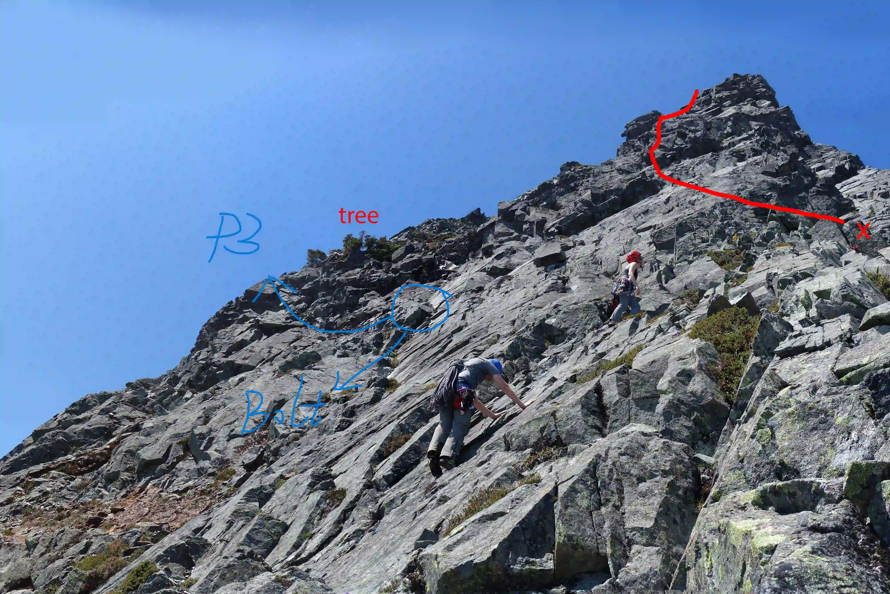
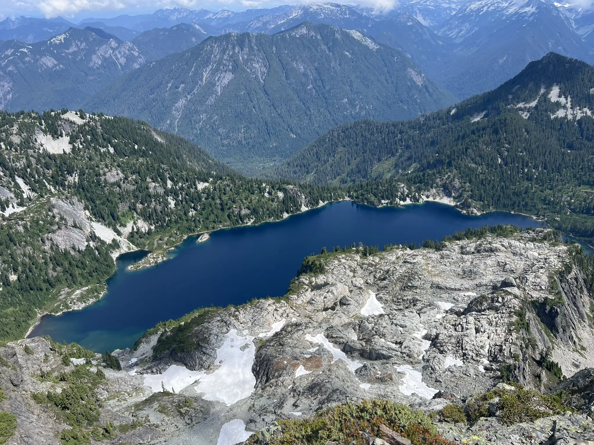
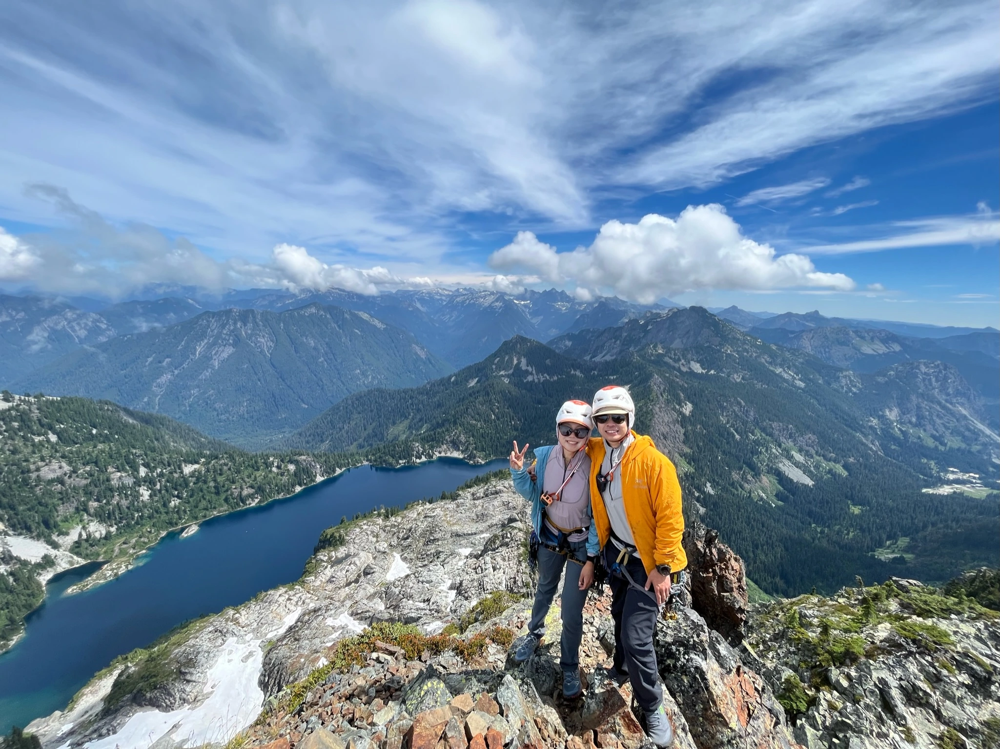
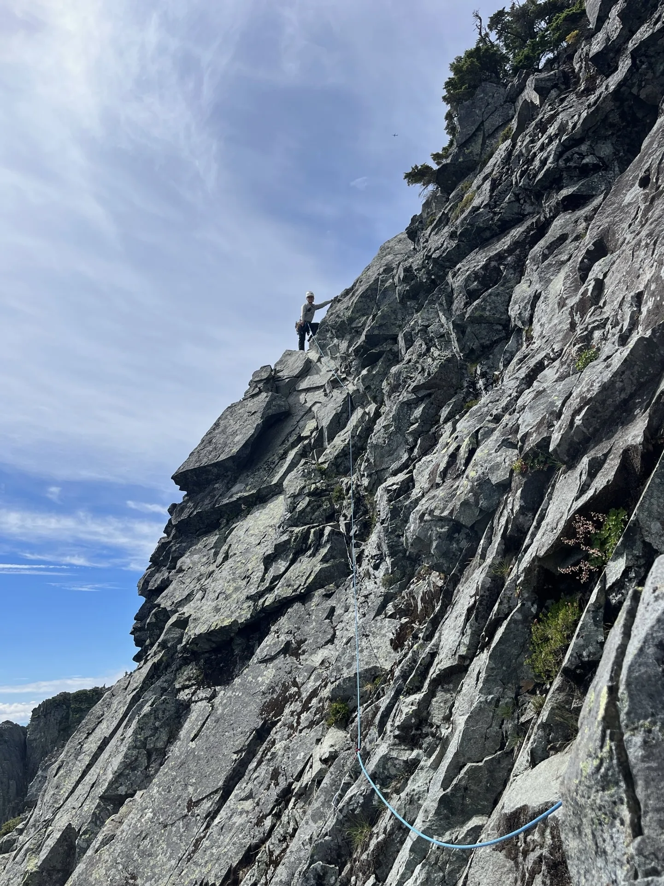
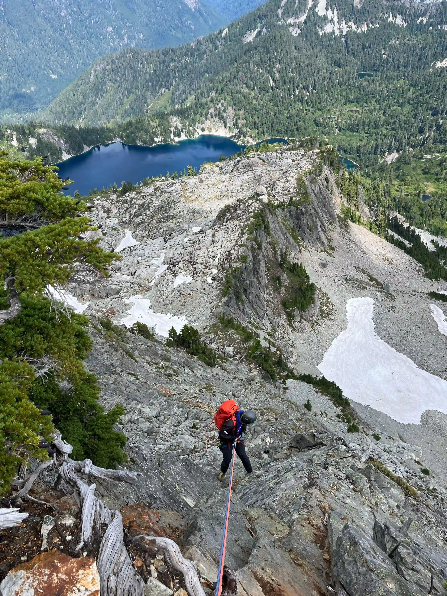

# Climbing Route Description
P1 & P2 (Class 4 with a few low Class 5 moves, ~60m):
We linked the first two pitches. I only placed one piece before reaching the P1 anchor, so I decided to continue. After the anchor, I placed two more pieces, all extended with double runners. We nearly ran out of rope but reached the tree anchor at the top of P2.

 

Scramble (Class 3–4):
From the top of P2, we turned left, crossed a relatively large flat area, and scrambled toward a very rusty bolt. The terrain started as easy Class 3 and steepened to Class 4 near the bolt. It can feel intimidating if you’re not comfortable on exposed Class 4 scrambling.

P3 (Low Class 5, ~30m):
From the rusty bolt, I downclimbed a step or two and traversed left toward a rib with a gnarly tree. Once on the rib, the terrain eased. There were limited protection options. I placed two pieces and belayed from the gnarly tree.

P4 (Class 4, ~60m):
One beginner climber in our group wasn’t comfortable with the Class 4 scramble to the false summit. I led the entire section without protection, reaching an obvious tree anchor on the climber’s left just at full rope.

Scramble to Summit:
The terrain eased after P4. We scrambled to the false summit and then followed Class 2 terrain to the true summit.

**Descend**
We downclimbed from the summit back to the top of P4 and made a double-rope rappel to the P3 anchor. From there, another double-rope rappel brought us down most of the scramble section. We downclimbed about 20 feet of Class 3–4 terrain to the flat area, then did a final double-rope rappel from the P2 anchor to the base.

Rockfall was unavoidable during the rappels — small to large rocks were dislodged despite careful climb. Thankfully we were the only party on the route, but if another team had been below us, it could have been very dangerous.

# Trip Report
We started hiking at 5:30 a.m. on Saturday from the Snow Lake trailhead. The approach followed the trail toward Snow Lake Divide. We were the first party on the mountain until we met another group near the talus field below Thumbtack. They were heading for the new sport route, while we were aiming for the NE Buttress—a relief for both parties, given the rockfall hazard on this mountain.

At Thumbtack Rock, we turned sharply right and ascended a grassy gully. This seemed like a good approach: direct and not exposed. After gaining the divide, we traversed off-trail to reach the base of the route. The approach took us about three hours — not fast.

The climbing itself was relatively easy, though protection was sparse. The rock quality on the actual climbing sections was generally solid. On the first pitch, I placed just one piece before reaching the anchor midway. Knowing the rope was long enough to link P1 and P2, I extended placements with double runners and continued to the tree anchor at the top of P2. We regrouped on a large flat area to the climber’s left, unroped, and scrambled about 250 feet to the rusty bolt.

We didn’t trust the bolt and instead slung a rock horn/boulder nearby. From there, I downclimbed slightly and traversed toward the rib, following the path of least resistance. Protection remained scarce, but the climbing was straightforward. Diffculty is around low Class 5, I placed two pieces. After stepping onto the rib, the climbing eased to exposed Class 3–4. I belayed from the gnarly tree, which had 3 old worn slings.

One follower in our group was uncomfortable on the Class 4 scramble to the false summit, so I led that pitch without placing gear, using nearly a full rope length to reach a tree anchor on the climber’s left. Loose rock was abundant. We took extra care to avoid sending debris down the route. After this pitch, we stashed the rope at the anchor tree (since we were the only team on route) and scrambled to the true summit. The view of Snow Lake was stunning.

  

After a break on the summit, we began the descent. Rockfall during rappels was inevitable—several sizable rocks went down despite our caution. If another party had been below us, it would have been extremely hazardous. I wouldn’t recommend rappelling this route if anyone else is climbing.

 

We reached the base and hiked out without incident. The entire trip took about 14 hours, longer than expected. The combination of the route’s ~800 feet of climbing, multiple double-rope rappels, and transition between scrambling and climbing sections slowed us down. Overall, it was a fun climb with beautiful scenery, but I likely wouldn’t repeat it due to the rockfall hazard.

GPS: https://www.peakbagger.com/climber/ascent.aspx?aid=2918713

> I used a pictures from [Mountaineers Route Description](https://www.mountaineers.org/activities/routes-places/chair-peak-northeast-buttress) to show the route. I'll remove this pics if it is not allowed.
