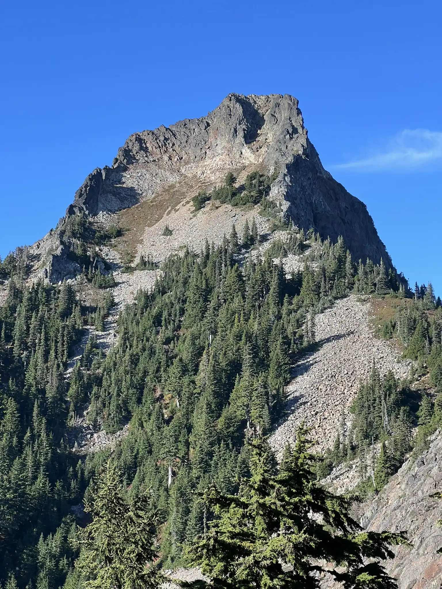
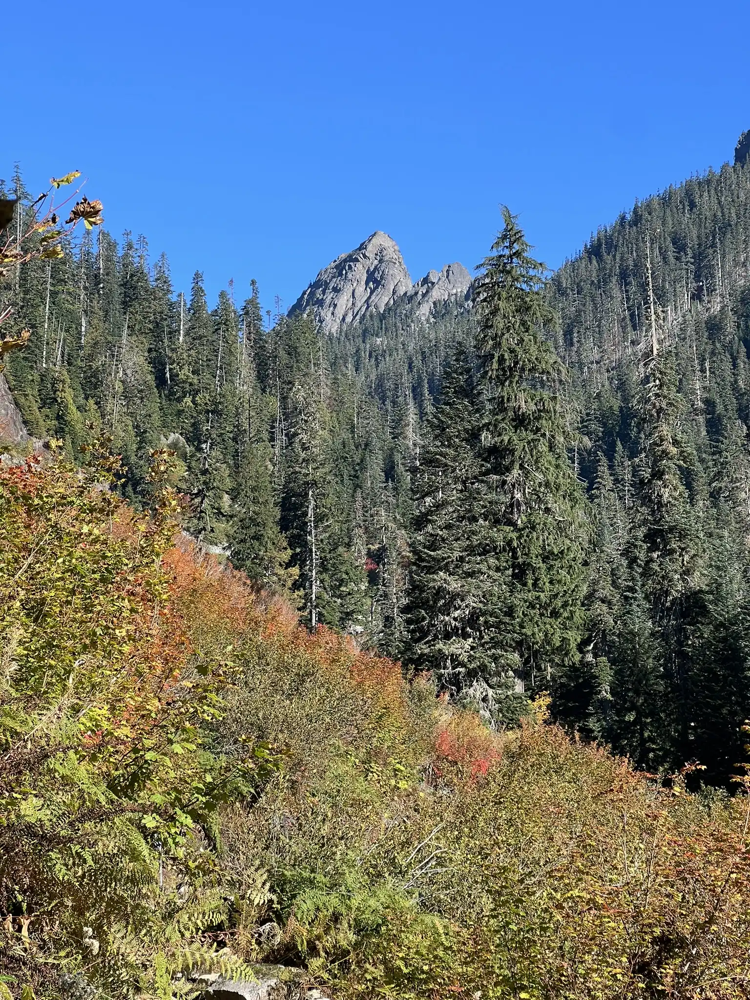
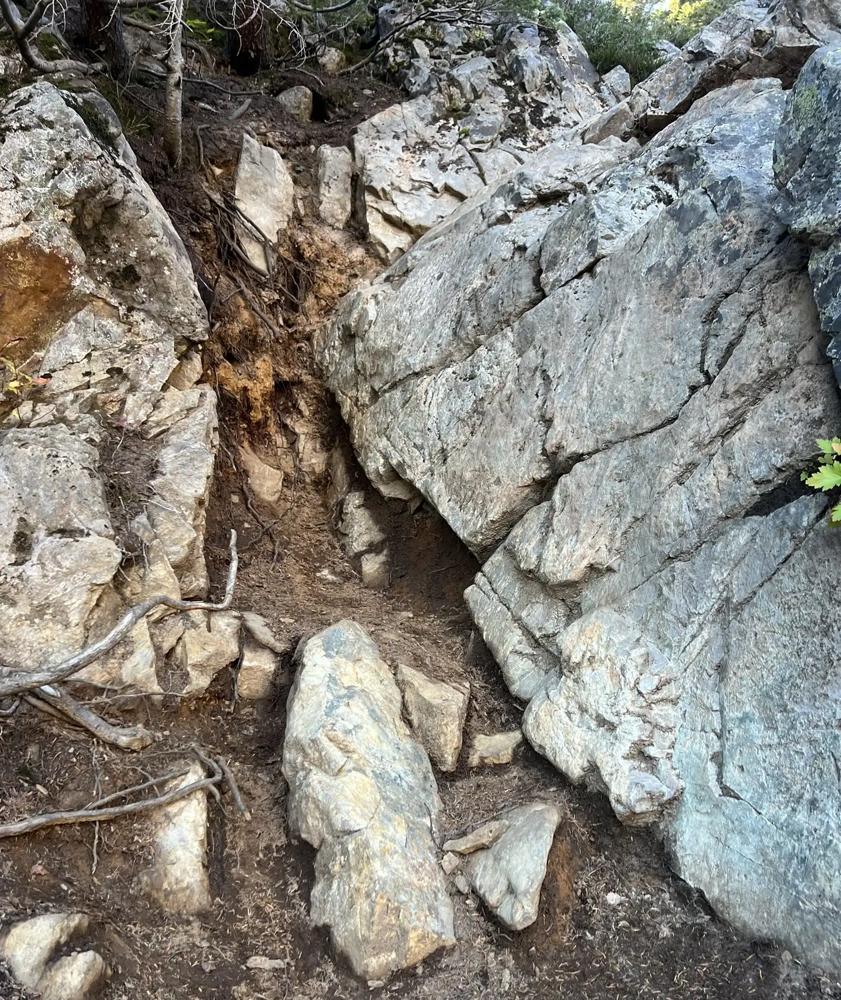

We had a late start at 9 AM from the Franklin Falls Parking Lot. The lot was under construction last year, which closed the trailhead, but now it’s fully reopened and much bigger, with plenty of restrooms!

The hike to the Melakwa lake is about 4.4 miles and took us around 2.5 hours. The trail becomes rocky after crossing the I-90 overpass, but the grade is fairly easy.

After reaching the Melakwa Lake, we continued on the climbers’ trail. It gets steep and can be easy to lose the path at times, but checking the route on GPS helped us stay on track. The crux of the route is the drop into the high basin after gaining Point 5699. The trail here is muddy, slippery, and full of rocks. On the way back, we discovered a better option: when descending into the basin, look to the climbers' left for a newer, more manageable path.

The rest of the trip to the base of the final scramble was uneventful. The scramble to the summit felt more like Class 3 to us, even though there’s a Class 2 option—it was just too loose for our liking. Overall, the scramble was pleasant and enjoyable.

It took us 5 hours and 10 minutes to reach the summit, covering a total of 12.42 miles in 10 hours and 18 minutes.

GPS track: https://www.peakbagger.com/climber/ascent.aspx?aid=2667026

  
