Stats:  
TH to Gardner Meadows: 5 hours 16 minutes  
Gardner Meadows to North Gardner Summit: 3 hours 44 minutes  
North Gardner Summit to Gardner Meadows: 2 hours 52 minutes  
Gardner Meadows to TH: 4 hours 33 minutes  

GPS Track: https://www.peakbagger.com/climber/ascent.aspx?aid=2872108

I first attempted North Gardner Mountain back in October 2023, but we had to turn back—unexpected snow on the ridge and no traction devices made it a no-go. This time, after seeing some successful summit reports in a Facebook group, Chutang and I decided to give it another shot and we made it.

We left the Seattle area at 6 AM on Friday and reached the trailhead around 10 AM. It’s a long drive. Our plan was to get to Gardner Meadows early enough to squeeze in an attempt on Abernathy Peak the same day. The hike in took about 5 hours. Compared to my 2023 visit, the trail was in much better shape, and we only encountered 6 to 8 downed trees, and unlike last time, we never lost the trail.

The weather wasn’t exactly confidence-inspiring. Even though the forecast called for dry conditions, we still got hit with light showers here and there. Nothing major, but just enough to make us wonder if it might turn into something heavier. Luckily, the rain held off, and we made it to Gardner Meadows dry by around 4 PM.

With about 5 hours of daylight left, we decided to go for Abernathy. In hindsight, not the smartest call. Progress was slow as we worked through the burn area, and after about an hour and twenty minutes, we decided to turn around. We got back to camp around 6 PM, checked the inReach, and saw that thunderstorms were in the forecast for the next afternoon. We ate dinner and called it an early night, hoping for a quick summit push before any weather moved in tommorrow.

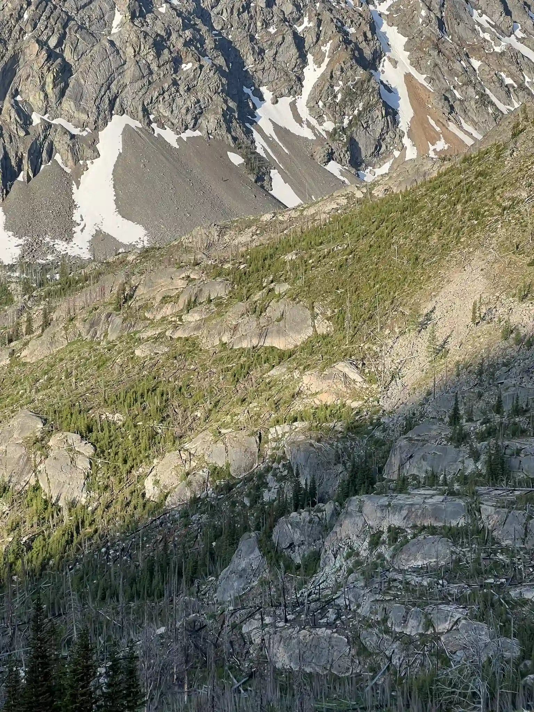 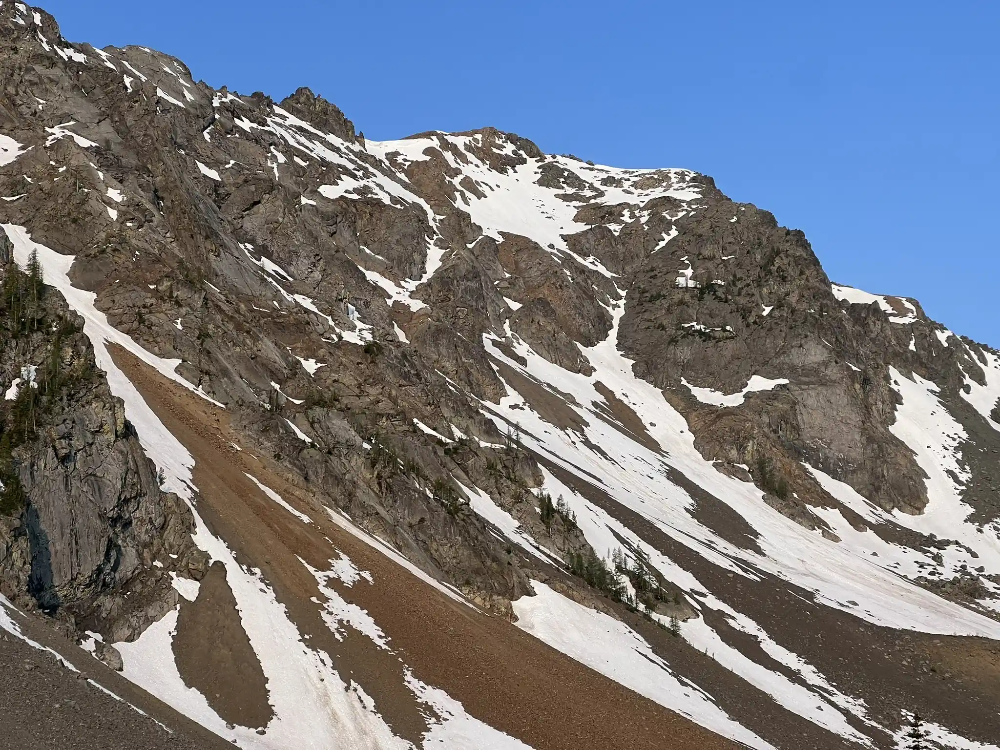

We were up at 5 AM and on the move by 5:50, not exactly alpine-start material, but good enough. Since we’d already summited Gardner Mountain on our last trip, we aimed farther left this time as we moved through Gardner Meadows. From camp, we could actually see the notch at 8,487 ft that we were targeting. To our superise, we met 2 ground of 6 deers on our way up the meadows. 

About an hour later, we reached the base of the scree basin. We switched to boots at the end of the vegetation, and that turned out to be a great decision. They gave us solid footing both up and down the loose scree and worked well on the final ridge too. After 2 hours and 37 minutes, we topped out at the notch. Honestly, the scree wasn’t too bad with boots on.

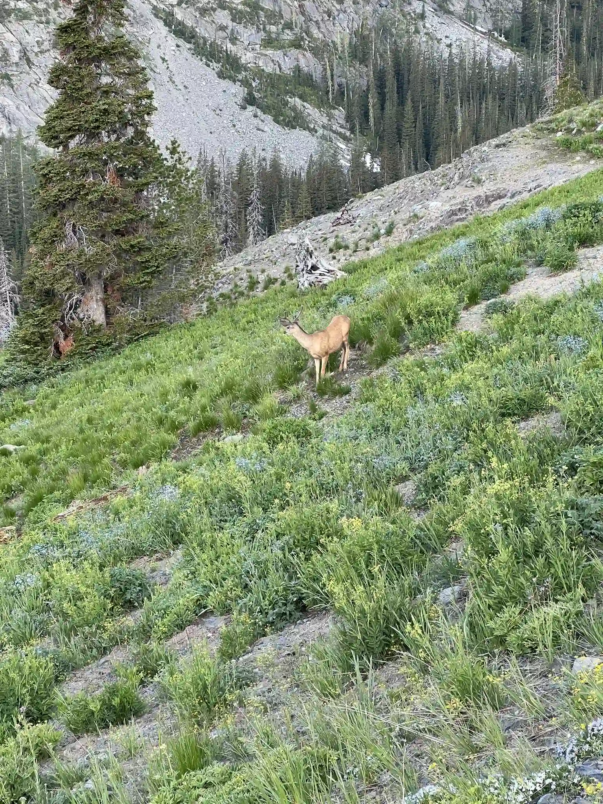 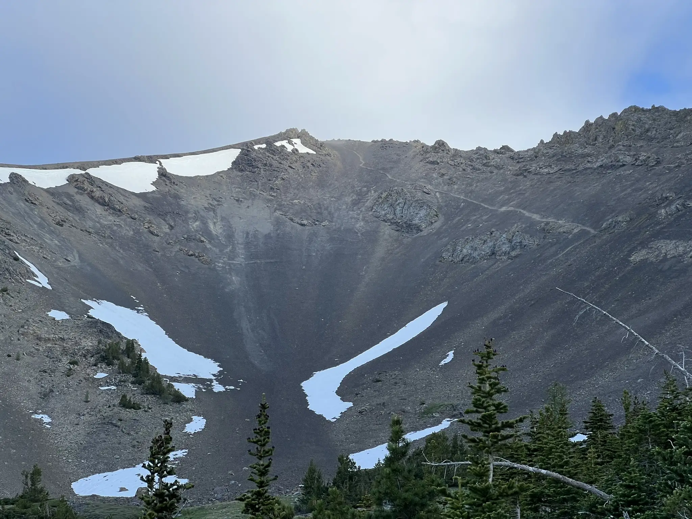 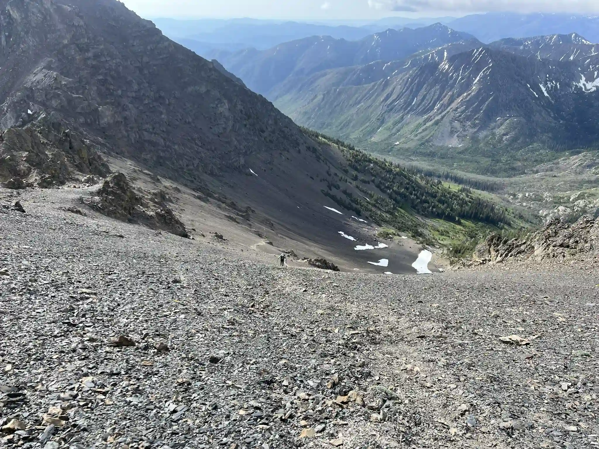

The ridge to the summit was mostly Class 2 with a few short Class 3 sections. The crux was near the end of the descending ridge, but nothing felt particularly exposed. Once on the main ridge, the climbing eased up. We crossed some Class 2 terrain, a few lingering snow patches, and finally stood on the summit. 3 hours and 44 minutes from camp—not bad. There’s a summit register up there with a pen, though the pen was struggling a bit at first.

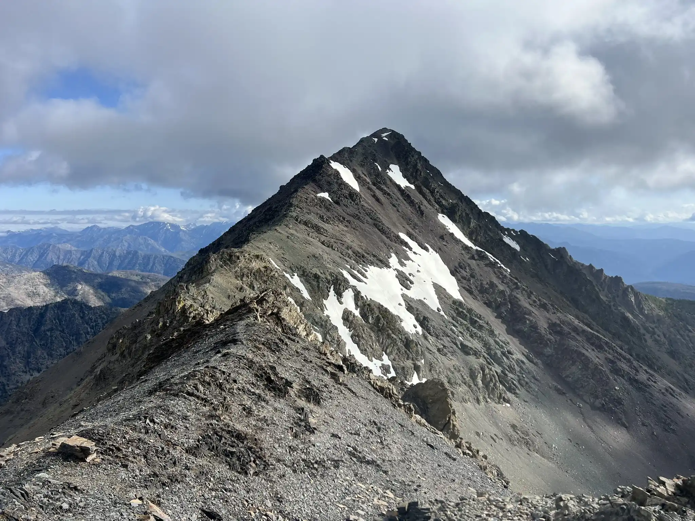 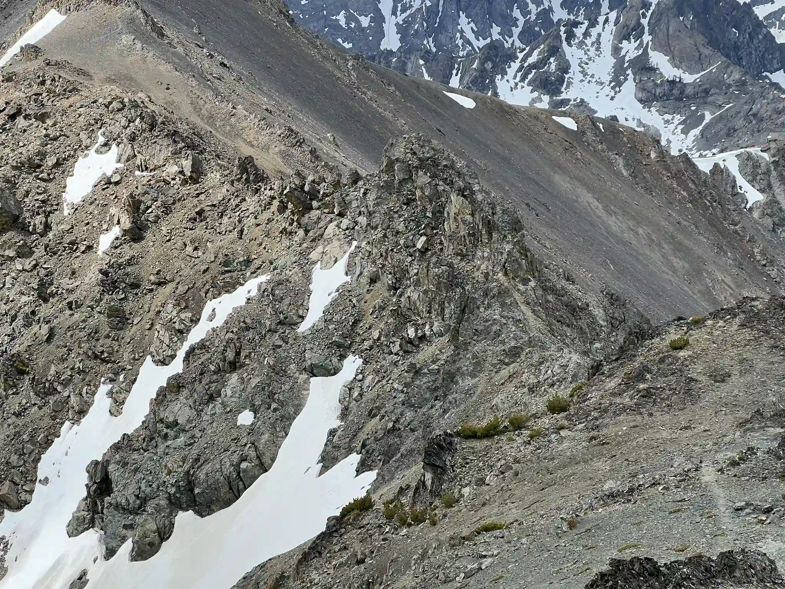 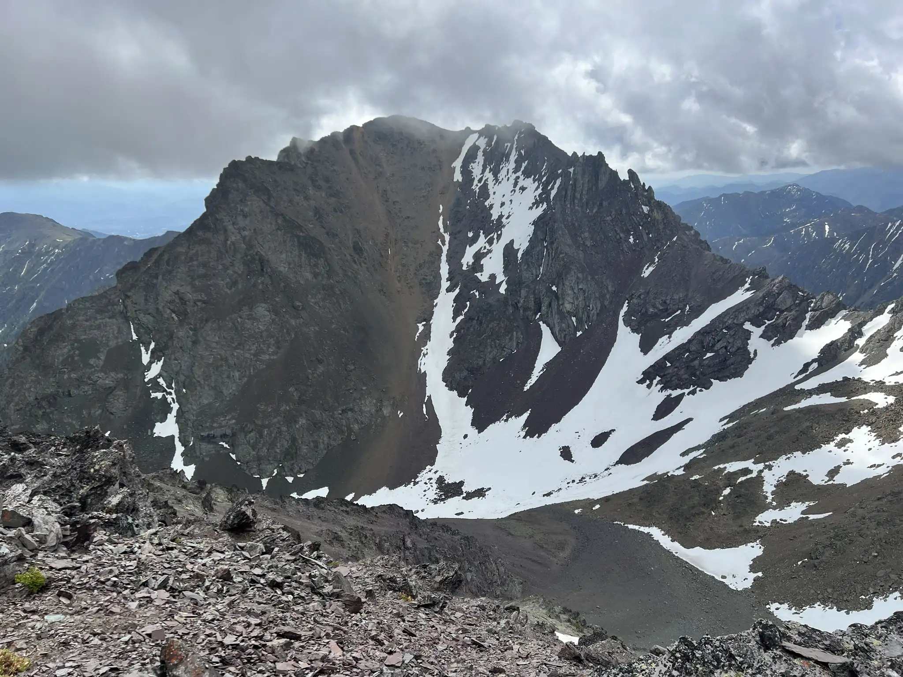

We soaked it in for a while, then made our way back down, arriving at camp around 1 PM. Felt good knowing that this was finally done, and that we wouldn’t need to hike back to Gardner Meadows again.

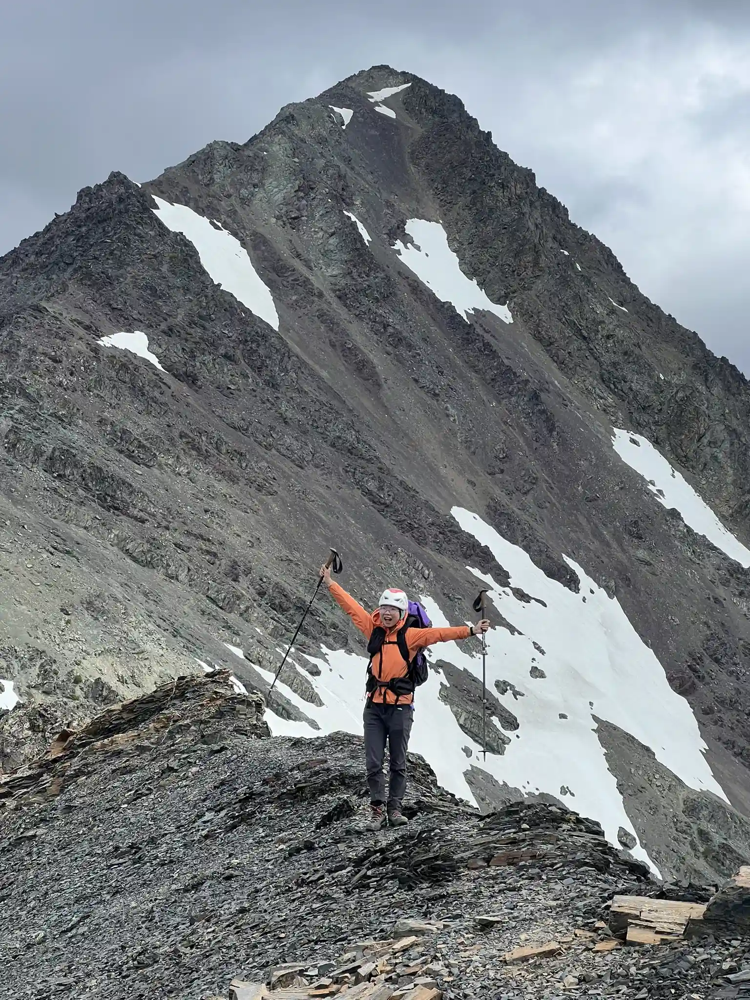 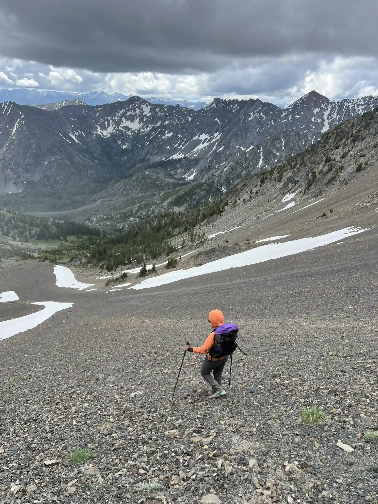 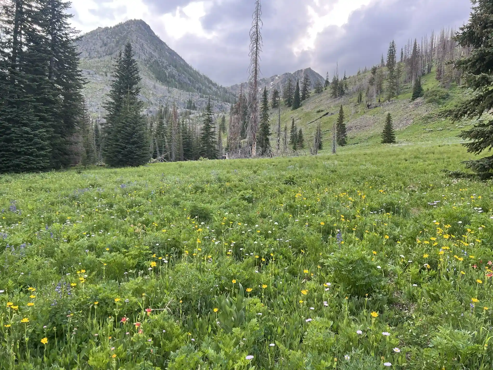
