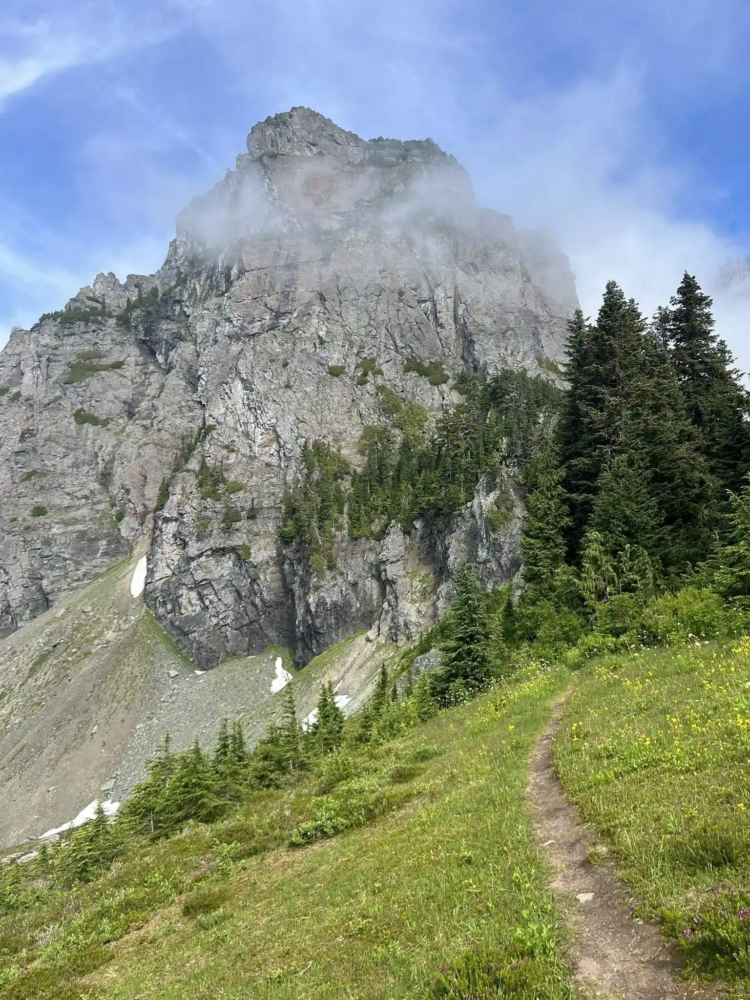
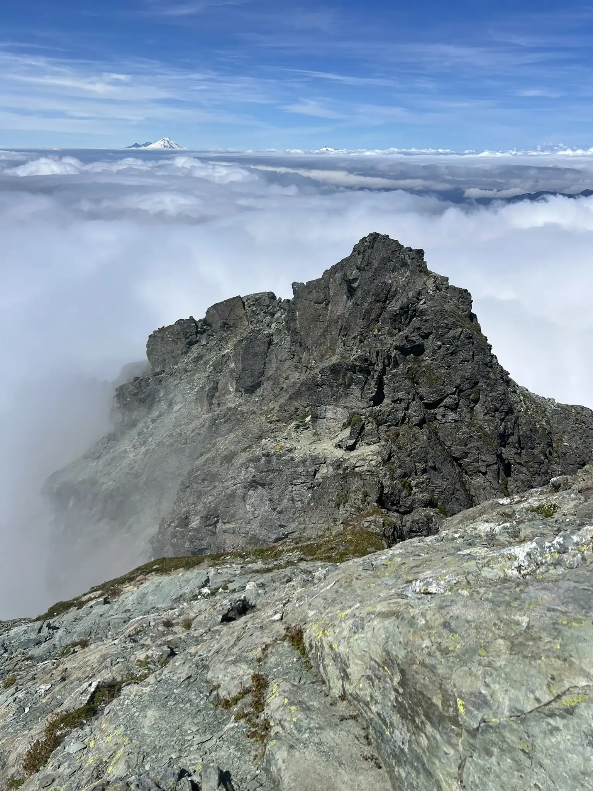
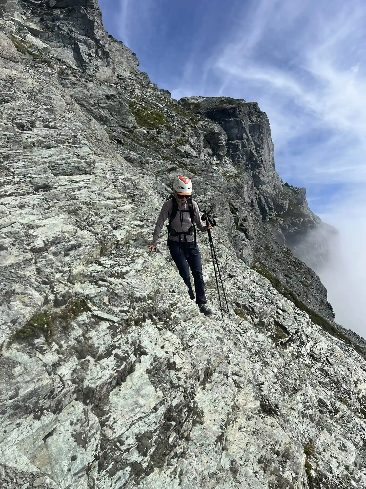
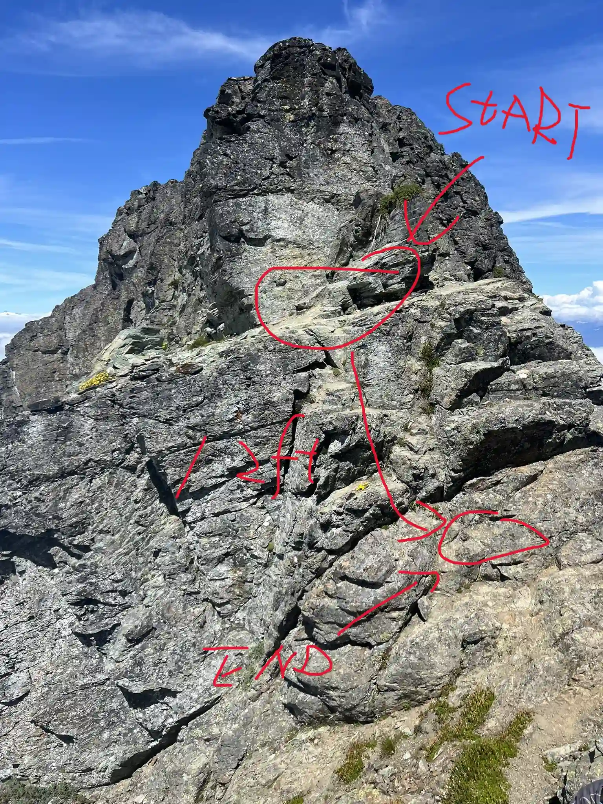
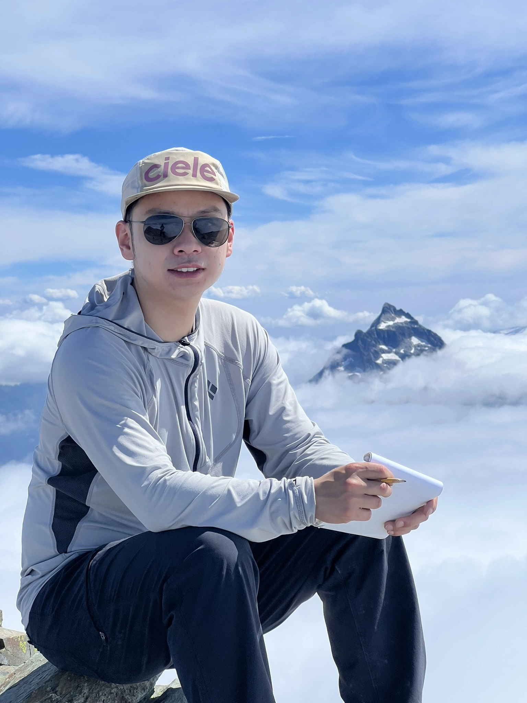

The forecast called for cloudy weather across the Cascades on Sunday, so we figured we’d be stuck in the clouds all day with no views. Because of that, we decided to go for a short scramble—something quick even if we ended up in whiteout conditions the whole time.

We’d heard the drive to the trailhead was rough, and that turned out to be very true. The road is about 12 miles of rough gravel with big potholes you can’t really dodge. We opted for the “better” approach by driving south from Darrington on Mountain Loop Highway for 10 miles, which is also what Google Maps recommends. Even with that route, it still took us about an hour and ten minutes to reach the base of the climb.

When you get close, you’ll come to a relatively large flat area just before the trailhead—park there and walk about 200 feet to the start. The parking at the actual trailhead is tiny, and turning our Ram 1500 around there was a pain with other cars parked.

 

Once we finally started hiking, the climb itself was really pleasant. The first 1.4 miles follow a nice trail, then you head up a steep gully to gain the ridge. From there, just follow the obvious path along the ridge until you hit a short, 12‑foot Class 3 downclimb through a notch. After that, the summit is right ahead. There are cairns along the route, and navigation is pretty straightforward if you follow the trail and stick to the path of least resistance.

People often mention a slab section here, but we didn’t find it difficult at all—at least in dry conditions. And it looks like there’s an easy way around if needed.

   

We popped in and out of the clouds on the ridge, but the summit itself was above them, which made for some cool views. Since we were expecting clouds anyway, it felt like a bonus. All in all, the trip took us about 5 hours round‑trip and covered roughly 4.2 miles. If you’re looking for a short outing with rewarding views (and don’t mind a rough drive), this one’s worth checking out!

GPS: https://www.peakbagger.com/climber/ascent.aspx?aid=2928731
